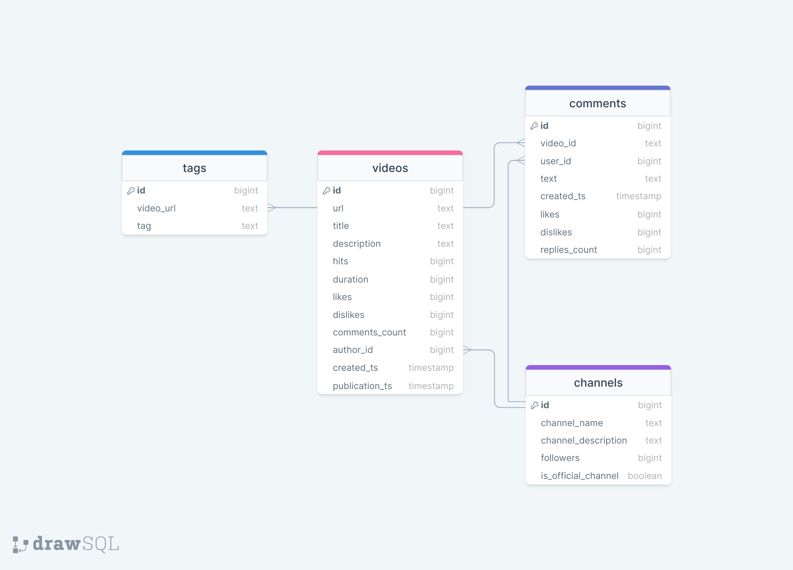

# RuTubeNews
___

## Задача

Целью создания ИТ-решения является сбор информации о новостных 
видеороликах с видеохостинга [RuTube](https://rutube.ru/), организация ее хранения 
в СУБД PostgreSQL и обогащение полученных данных средствами 
искусственного интеллекта.

---

## Сбор данных

Используя API сервиса, получаем информацию о видеороликах, 
каналах и комментариях:
- Основная информация о видео https://rutube.ru/api/video/...
- Лайки/дизлайки https://rutube.ru/api/numerator/video/.../vote
- Комментарии https://rutube.ru/api/comments/video/...
- Информация о канале https://rutube.ru/api/profile/user/...

### Алгоритм

1. Получаем url видеороликов за определенный период (в рамках предоставленного решения выбраны все видео за апрель 2024) вместе с id канала.
2. С помощью библиотеки httpx асинхронно получаем информацию о роликах, авторах и комментариях.

### Описание собранных данных

Информация о видео:
- url - ссылка на видеоролик
- title - название видеоролика
- description - описание видеоролика
- hits - количество просмотров
- duration - длительность видеоролика
- likes - количество лайков
- dislikes - количество дизлайков
- comments_count - количество комментариев
- author_id - id канала
- created_ts - время создания 
- publication_ts - время публикации

Информация о канале:
- id - id канала
- channel_name - название канала
- channel_description - описание канала
- followers - количество подписчиков
- is_official_channel - является ли канал официальным

Комментарии к видео
- id - id комментария
- video_id - id видеоролика 
- author_id - id автора комментария 
- text - содержание комментария 
- created_ts - дата, когда оставлен комментарий
- likes - лайки на комментарии 
- dislikes - дизлайки на комментарии
- replies_count - количество ответов на комментарий

---

## Организация хранения собранных данных

Логическая схема базы данных

Используемая СУБД - **PostgreSQL 16.2** на debian 12 в Proxmox LXC контейнере.

Используемая программа для администрирования СУБД - pgAdmin 4.

Для написания SQL-запросов используется JetBrains DataGrip.

Для подключения к БД и загрузки собранных данных используется библиотека SQLAlchemy.

---

## Обогащение данных

С помощью библиотеки spacy из сочетания наименование + описание видеоролика "вытаскиваются" теги, основная информация.
Таким образом происходит кластеризация видеороликов.

### Алгоритм

1. Получаем строку название + описание.
2. Определяем язык, полученной строки (langdetect).
3. Если строка не на русском языке, переводим (deep_translator).
4. Обработанную строку прогоняем через модель нейронной сети, получая словарь тегов.
5. Загружаем в БД полученную информацию (url видеоролика, наименование тега)
